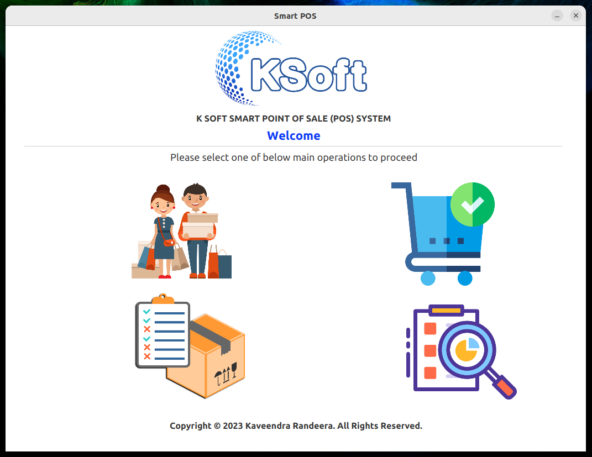
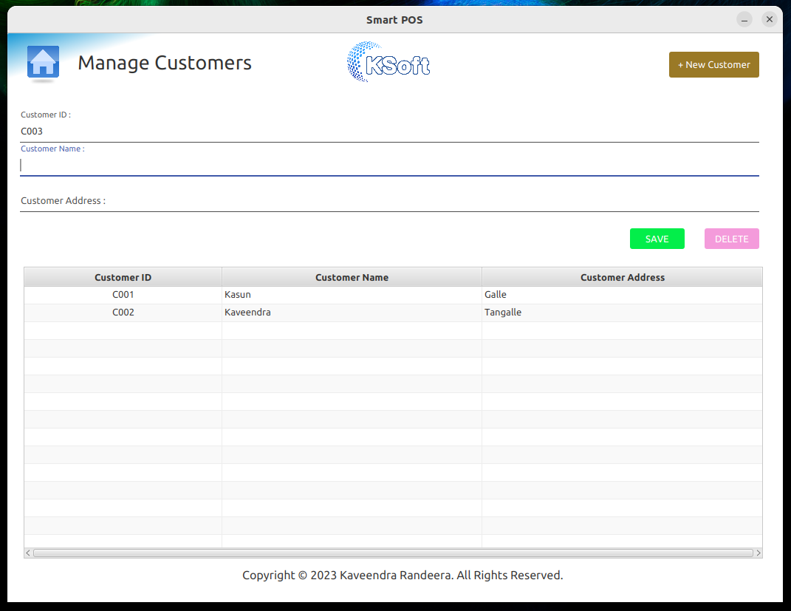
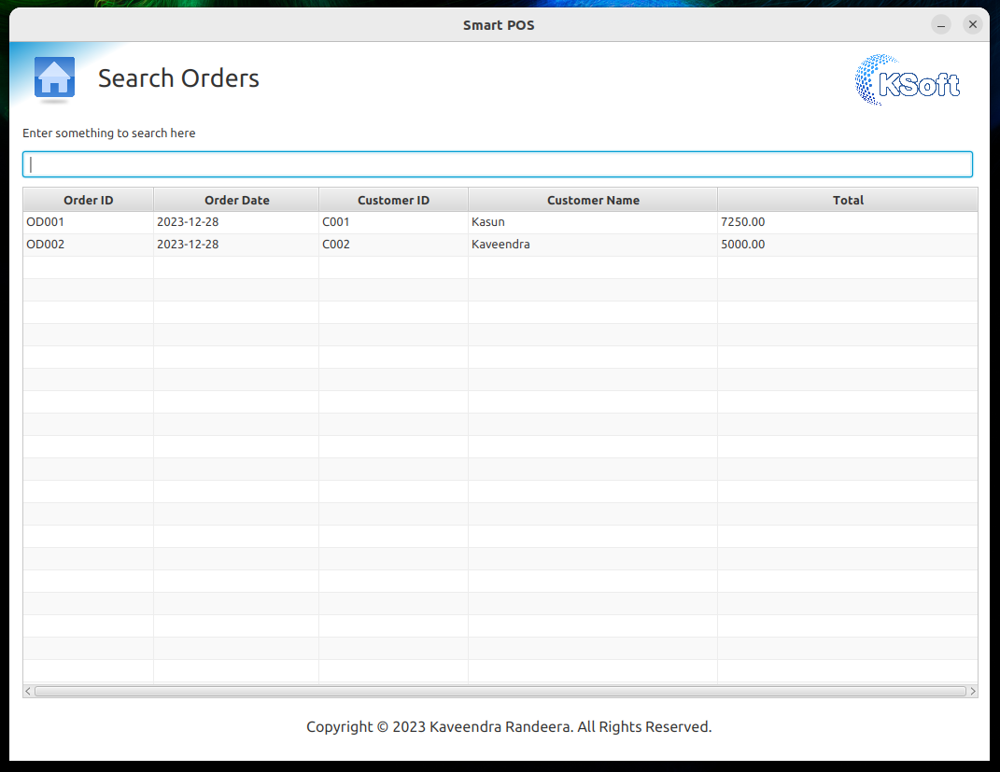
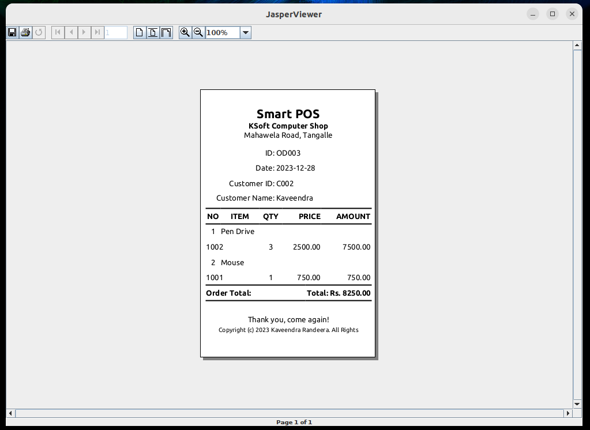
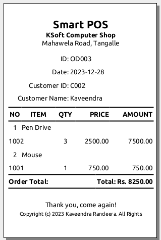

# Smart POS
Revolutionizing retail with intuitive, all-in-one point of sale software. Seamlessly manage transactions, inventory, and customer relations with cutting-edge efficiency. Designed for the modern business. Elevate your sales experience.

## Version
v 1.0.0

## Features
1. Manage Customers (Add New Customer / Remove existing Customer)
2. Manage Items (Add New Items / Remove existing item
3. Auto Generating OrderNos and CustomerNos
4. Place an Order (Multiple item selection)
5. Calculate the total bill amount
6. Check Stock quantities
7. Print the invoice
8. Search Orders and Customers
9. Any Many more


## Images







## Languages Used
1. Java 11

## Technology Used
1. Java FX
2. Java SE
3. Scene Builder
4. Maven
5. jasper Soft
6. Postgresql

## IDE (Integrated Development Environment)
IntelliJ IDEA Ultimate Edition

## How to try this project

To try out the project, please follow these Git commands in your terminal:
1. Clone the Project
   ```
   https://github.com/randeera/desktop-k-soft-smart-pos-system.git
   ```
2. Build the project from parent folder
   ```
   mvn clean install
   ```

3. Then execute the AppInitializerWrapper class<br>

## Contributing
Contributions are welcome! If you find any bugs or have suggestions for improvement, please open an issue or submit a pull request.

## License

MIT License<br>
Copyright &copy; 2023 Kaveendra Randeera. All Rights Reserved.

<hr/>

### ☛ Contact Me
- Email-  mailto:khkrandeera@gmail.com
- Linkedin-https://www.linkedin.com/in/randeera/

### ☛ Follow Me
- GitHub-https://github.com/randeera
- Linkedin-https://www.linkedin.com/in/randeera/
